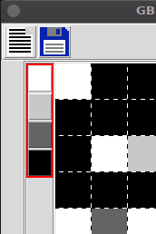
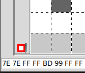
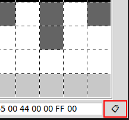
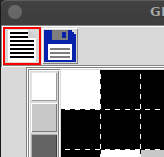
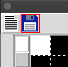
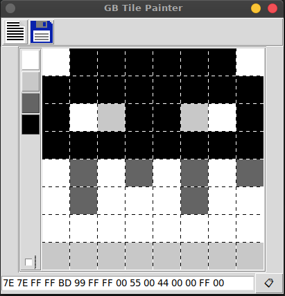
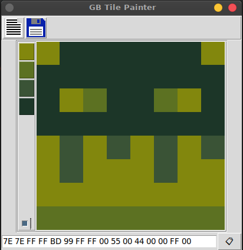

# GB Tile Painter
A tool for painting Game Boy tiles. No dependencies, just works.

## Running
No installation needed. If you have Python, launch the script by running:
~~~
python3 gb-tile-painter.py
~~~

## Usage
* Draw on the canvas by holding down the left mouse button on the canvas.

* Change the drawing color:

* Switch to preview mode:

* Copy hexdump to clipboard:

* Save hexdump to file:

* Save image as binary data:

## Screenshots
Edit mode:

Preview mode:
